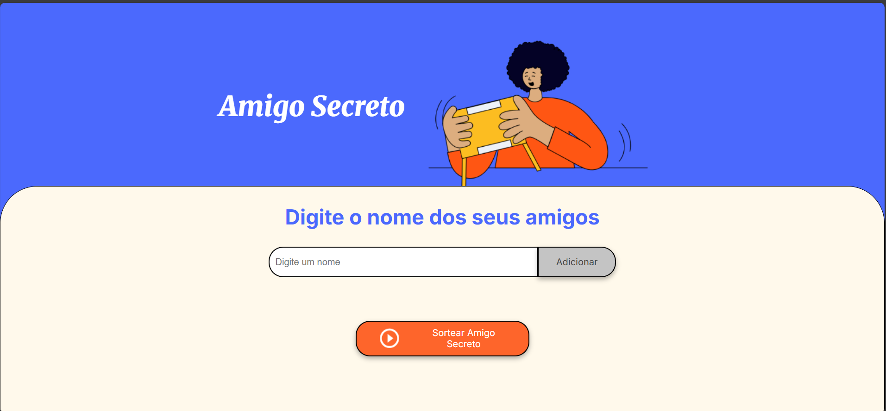
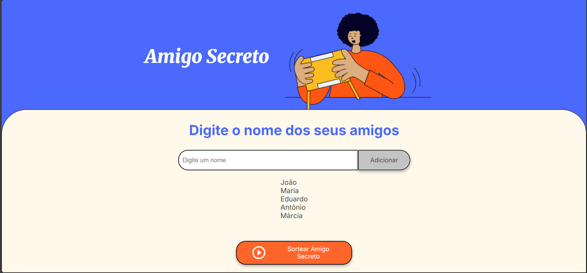
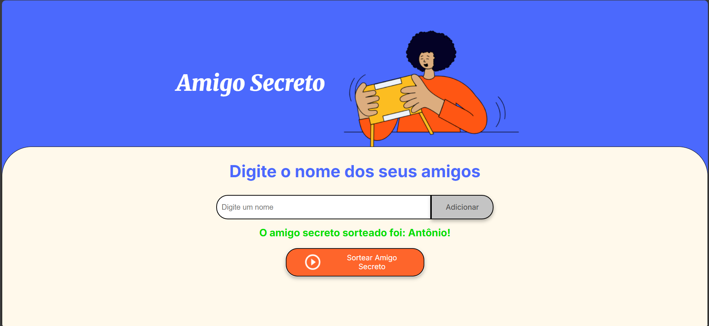

<h1 align="center">🎁 Amigo Secreto 🎁</h1>

  

  <b>Simule um sorteio de amigo secreto de forma simples, rápida e divertida!</b>

  
  
  
  

---

## 📦 Sobre o Projeto

O **Amigo Secreto** é um sistema web para sorteio de amigos secretos. Basta adicionar os nomes dos participantes e clicar em sortear para descobrir quem será o amigo secreto!

---

## ✨ Funcionalidades

- ➕ Adicionar nomes de participantes
- 🗒️ Visualizar a lista de amigos adicionados
- 🎲 Sortear aleatoriamente um amigo secreto
- 🚫 Validação para evitar campos vazios

---

## 👀 Demonstração

  
  

---

## 🚀 Tecnologias

-  HTML5  
-  CSS3  
-  JavaScript

---

## 📸 Imagens do Sistema

  
  
  

---

  Projeto desenvolvido com base no conhecimento e auxílio do curso <b>Oracle ONE da Alura</b>

